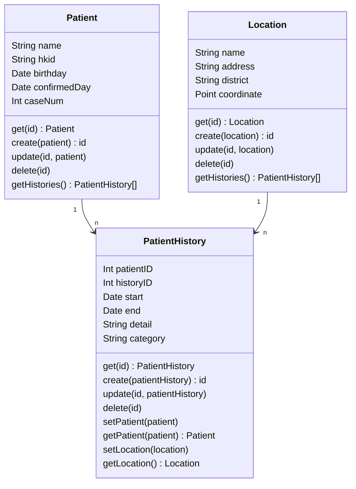

# Trans19 Sprint 1 Design Model

```mermaid
classDiagram

Patient "1" --> "n" PatientHistory

Location "1" --> "n" PatientHistory

class Patient{
    String name
    String hkid
    Date  birthday
    Date  confirmedDay
    Int   caseNum
    get(id) Patient
    create(patient) id
    update(id, patient)
    delete(id)
    getHistories() PatientHistory[]
}

class Location{
    String name
    String address
    String district
    Point coordinate
    get(id) Location
    create(location) id
    update(id, location)
    delete(id)
    getHistories() PatientHistory[]
}

class PatientHistory{
    Int patientID
    Int historyID
    Date start
    Date end
    String detail
    String category
    get(id) PatientHistory
    create(patientHistory) id
    update(id, patientHistory)
    delete(id)
    setPatient(patient)
    getPatient(patient) Patient
    setLocation(location)
    getLocation() Location
}
```