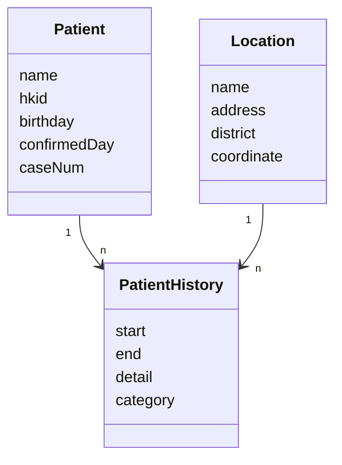

# Trans19 Sprint 1 Domain Model

```mermaid
classDiagram

Patient "1" --> "n" PatientHistory

Location "1" --> "n" PatientHistory

class Patient{
    name
    hkid
    birthday
    confirmedDay
    caseNum
}

class Location{
    name
    address
    district
    coordinate
}

class PatientHistory{
    start
    end
    detail
    category
}
```